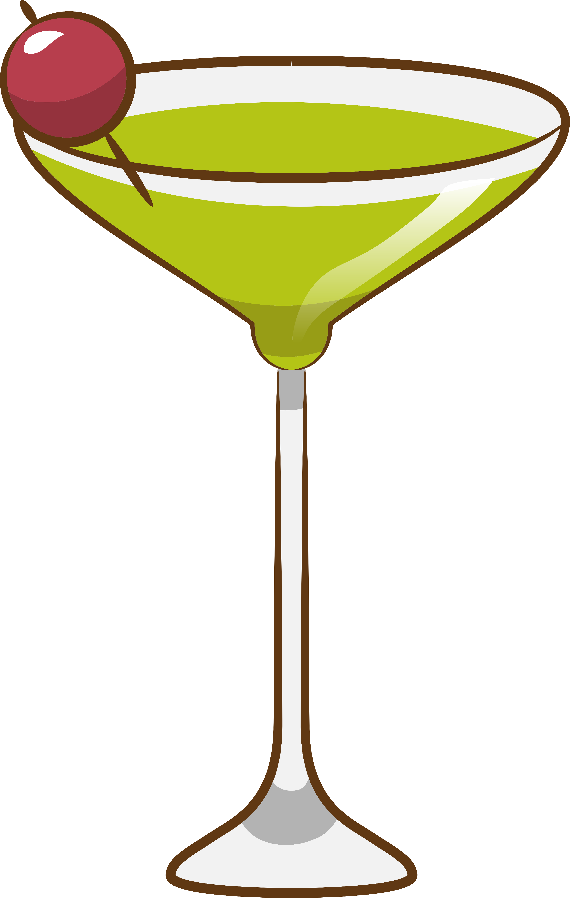

<!--

author:   
version:  0.1.0
language: EN
narrator: US English Female Female

import: https://raw.githubusercontent.com/liaTemplates/AVR8js/main/README.md
import: https://raw.githubusercontent.com/liascript-templates/plantUML/master/README.md
import: https://github.com/liascript/CodeRunner

-->

[](https://liascript.github.io/course/?https://github.com/HansGrundig/ROB-Cocktailsort/blob/main/README.md)

# Cocktailsort on a Strip of 12 LEDs


## Cocktail Sort in a Nutshell

This is a repository for the projects of the english course for BOB  students at the TU Freiberg.
Cocktail sort is an improvement on the Bubble Sort algorithm.

Key features:

- Swaps elements in both directions of the list.
- Reduces the number of comparisons and swaps.

Performance:

- Can be faster than Bubble Sort for small datasets.
- Stable sorting algorithm (preserves relative order of equal elements).
- Easy to implement.

Suitable for:

- Small to medium-sized datasets.
- Educational purposes

Drawbacks:

- Inefficient for large datasets.
- Slower than more efficient sorting algorithms like Quicksort or Mergesort.


## Code 
- kurze Bedeutung der einzelnen Farben
```
Code 
```
## Simulation

<div id="matrix-experiment">
<wokwi-neopixel-matrix pin="6" cols="12" rows="1"></wokwi-neopixel-matrix>
<span id="simulation-time"></span>
</div>

```cpp             Automata
#include <Arduino.h>
#include "FastLED.h"
#define DATA_PIN 6
#define BRIGHTNESS 180
#define NUM_LEDS 12
#define NUM_COLORS 6
int i = 0;
CRGB leds[NUM_LEDS];
CRGB colors[] = {
CRGB::Black,
CRGB::Purple,
CRGB::Blue,
CRGB::Green,
CRGB::Yellow,
CRGB::Red};
int sort[NUM_LEDS];

void led_colorval(int* array, CRGB* colors)
{
  for(int i = 0; i < NUM_LEDS; i++){
    leds[i] = colors[sort[i]];
  }
}

void cocktailShakerSort (int* list, int length)
{
    int j = 0;
    int swapped = 0;
    do
    {
        for (int i = 0; i < length; i ++)
        {
            if (list[i] > list[i + 1]) // Elements in wrong order?
            {
                // Swap!
                int temp = list[i];
                list[i] = list[i + 1];
                list[i + 1] = temp;
                swapped = 1;
                delay(250); 
                led_colorval(list, colors);
                FastLED.show(); 
            }
        }
        if (!swapped) return;
        for (int i = length; i > 0; i--)
        {
            if (list[i] < list[i - 1])
            {
                int temp = list[i];
                list[i] = list[i - 1];
                list[i - 1] = temp;
                swapped = 1;
                delay(500); 
                led_colorval(list, colors);
                FastLED.show(); 
            }
        }
    }
    while (swapped == 1);
    return;
}

void setup()
{
  FastLED.addLeds<NEOPIXEL, DATA_PIN>(leds, NUM_LEDS);
  FastLED.setBrightness(BRIGHTNESS);
}

void loop()
{
  for(int i = 0; i<NUM_LEDS; i++)
  {
    sort[i] = rand() % (NUM_COLORS -1) +1;
  }
  led_colorval(sort, colors);
  FastLED.show();
  delay(1500);

  cocktailShakerSort(sort, NUM_LEDS);
  
  //delay(2000);
}
```
@AVR8js.sketch(matrix-experiment)

## Further Improvements
- programm other Sorting Algorithems 
- print the values of the represented colour in console

## Sources
img 1: https://de.vecteezy.com/png/19613611-cocktail-png-grafik-clipart-design


